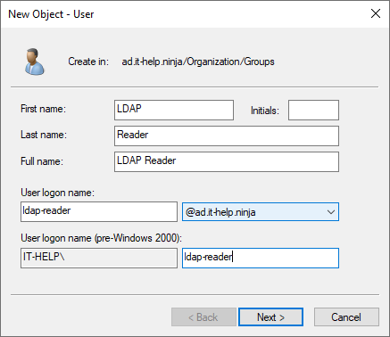
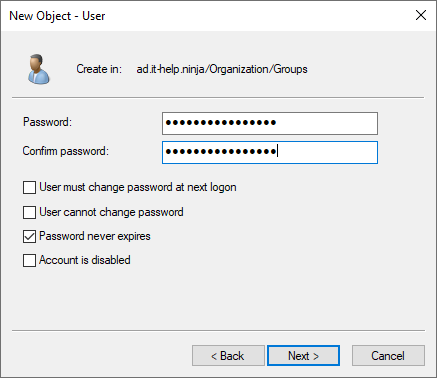
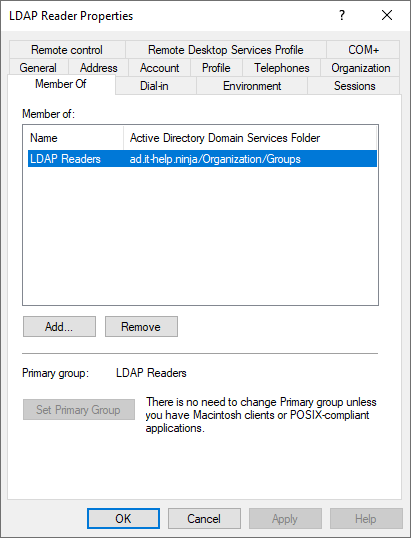
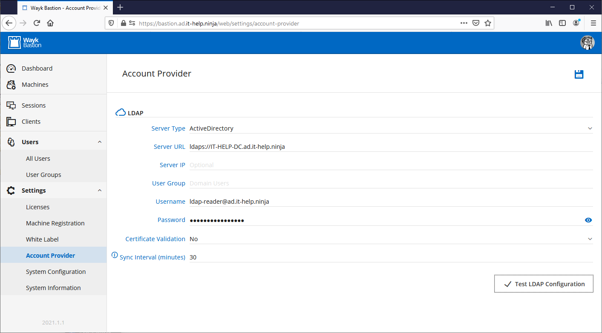
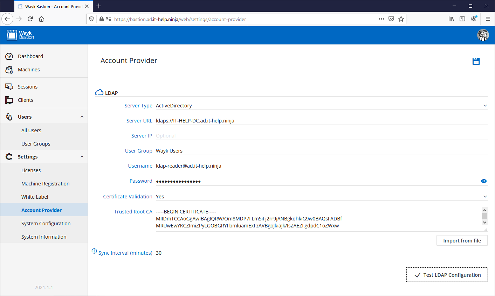
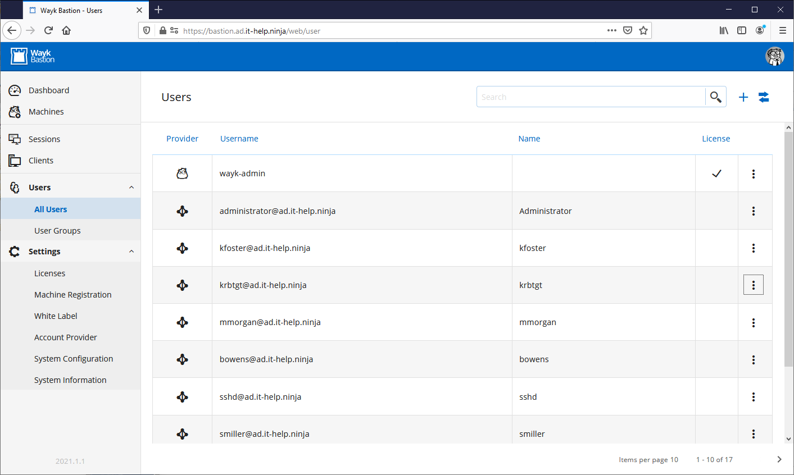
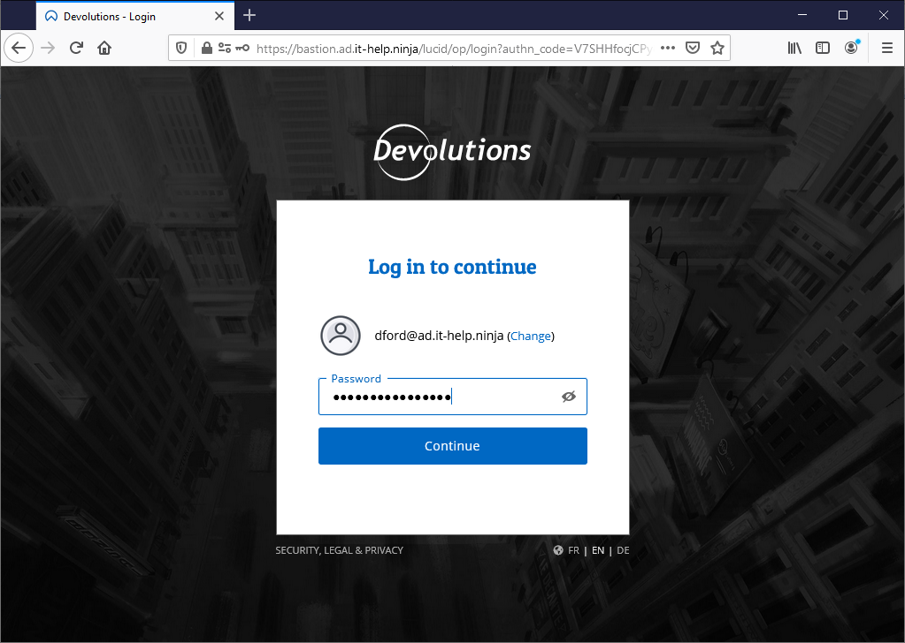

# Active Directory Integration

Wayk Bastion supports Active Directory integration, such that you can leverage your existing user accounts instead of creating new ones. When enabled, a list of users from a specified group will be automatically synchronized in Wayk Bastion to become the primary user directory. Domain users are validated using LDAP authentication behind the scenes. To get started, you need the following:

1. A dedicated LDAP reader account for synchronization
1. Secure LDAP (LDAPS) configured in Active Directory

## LDAP reader account creation

The Wayk Bastion server does not support integrated Windows authentication, such that you cannot run it under a Windows identity without giving credentials for a domain account explicitly. Active Directory contains a lot of information publicly available to anyone with a valid account, including the list of users, user groups, and group membership information. Since Wayk Bastion only needs to *read* this information and nothing more, the ideal is to create a restricted user account.

*Do not* create a regular user account that is a member of one of the built-in groups, as it could potentially be used for more than just read from LDAP (network logon, local logon, etc).

Create the *LDAP Readers* group in the global scope:


Create the *LDAP Reader* user:



Use a long generated password, and enable "Password never expires":



Change the primary group of the *ldap-reader* account to the *LDAP Readers* group, then remove all other group memberships: 

```powershell
$LdapReader = Get-ADUser "ldap-reader"
$LdapReaders = Get-ADGroup "LDAP Readers" -Properties PrimaryGroupToken

Add-ADGroupMember -Identity $LdapReaders.SID -Members $LdapReader.SID
Set-ADUser $LdapReader -Replace @{ PrimaryGroupId = $LdapReaders.PrimaryGroupToken }

Get-ADPrincipalGroupMembership ldap-reader | `
	Where-Object { $_.SID -ne $LdapReaders.SID } | `
	Foreach-Object { Remove-ADGroupMember -Identity $_.SID -Members $LdapReader.SID }
```

The *ldap-reader* account should now be only a member of the *LDAP Readers* group, excluding the built-in *Domain Users* group:



Save the username for the account in UPN format (ldap-reader@ad.it-help.ninja) and the associated password for later.

## Configuring Secure LDAP (LDAPS)

Wayk Bastion requires Secure LDAP (LDAPS) to be enabled in Active Directory to secure communication with the domain controller. While insecure LDAP traffic is common in a Windows domain, it is becoming increasingly difficult to support due to recent changes in [LDAP channel binding and signing requirements](https://support.microsoft.com/en-us/topic/2020-ldap-channel-binding-and-ldap-signing-requirements-for-windows-ef185fb8-00f7-167d-744c-f299a66fc00a). Requiring LDAPS is the safest and simplest option, with the side benefit of promoting Active Directory best practices.

[How to set up Secure LDAP for Active Directory](https://astrix.co.uk/news/2020/1/31/how-to-set-up-secure-ldap-for-active-directory) is an excellent step-by-step guide showing the different ways Secure LDAP can be configured properly.

The most common choice for the certificate authority is Active Directory Certificate Services (AD CS), because it is tightly integrated in Active Directory . However, it is also possible to use a certificate from a public certificate authority like Let's Encrypt.

As a last resort, you can generate a self-signed certificate: this won't work for LDAPS traffic with domain-joined machines, but it be sufficient for Wayk Bastion integration with certificate validation disabled. You can always get started this way, then configure LDAPS properly later. Run the following code snippet to generate the self-signed certificate, import it into the NTDS certificate store, then tell the LDAP server to load:

```powershell
$DomainName = "$Env:UserDnsDomain".ToLower()
$DnsName = $Env:ComputerName + "." + $DomainName
$Certificate = New-SelfSignedCertificate -DnsName $DnsName -CertStoreLocation "cert:\LocalMachine\My"
$CertificateThumbprint = $Certificate.Thumbprint

$LocalCertStore = 'HKLM:/Software/Microsoft/SystemCertificates/My/Certificates'
$NtdsCertStore = 'HKLM:/Software/Microsoft/Cryptography/Services/NTDS/SystemCertificates/My/Certificates'

if (-Not (Test-Path $NtdsCertStore)) {
    New-Item $NtdsCertStore -Force
}

Copy-Item -Path "$LocalCertStore/$CertificateThumbprint" -Destination $NtdsCertStore

$dse = [adsi]'LDAP://localhost/rootDSE'
[void]$dse.Properties['renewServerCertificate'].Add(1)
$dse.CommitChanges()
```

The domain controller should now respond to TLS handshakes on port 636:

```powershell
openssl s_client -connect IT-HELP-DC.ad.it-help.ninja:636 -showcerts
```

If you test connectivity with ldp.exe, it will be difficult to tell if LDAPS is enabled: there is no difference between a connection error and a certificate validation error in the user interface, which is why it is easiest to test with the OpenSSL command-line tool.

## Wayk Account Provider

In **Settings**, go to the **Account Provider** section, then select **Active Directory** as the LDAP server type:


Fill the form with data similar to this:

 * Server URL: ldaps://IT-HELP-DC.ad.it-help.ninja
 * User Group: Domain Users
 * Username: ldap-reader@ad.it-help.ninja
 * Password: (ldap-reader password)



Click the **Test LDAP Configuration** button to validate the configuration. If it worked, click the **Save** button at the top right of the screen.

If you have a proper certificate authority in place, with a certificate that should validate automatically for the domain controller (don't forget the DNS name must match the one in the certificate!), then you can go one step further and enable certificate validation:



For private certificate authorities, you need to import the certificate authority certificate in PEM format into the **Trusted Root CA** field for automatic validation to work.

If validation still fails, make sure that the name in the certificate matches the hostname used in the **Server URL** field. If you don't have DNS properly configured from the machine where Wayk Bastion is hosted, you can always manually specify the IP address of the domain controller in the **Server IP** field while using the correct hostname in the **Server URL** field. However, some LDAPS certificates encode the IP address, causing validation issues when this trick is used.

You can now go in **Users**, then **All Users**, and you should now see the list of users synchronized from Active Directory:



The users synchronized in Wayk Bastion are all members of the user group previously configured. While the built-in Domain Users group may be sufficient, it unfortunately tends to contain a few undesirable accounts (krbtgt, sshd, etc). To avoid this issue, create a dedicated "Wayk Users" group in Active Directory and add all the user groups and users in it that should be synchronized in Wayk Bastion.

It should now be possible to create new user groups from this flat list of users. There is currently no advanced synchronization of user groups from Active Directory with user groups in Wayk Bastion.

## Wayk User Login

To login with one of the Active Directory users, enter the username in UPN format (dford@ad.it-help.ninja) and the same password normally used for Windows:



If login fails, make sure you that the Active Directory users have been added to user groups in Wayk Bastion with sufficient permissions to access the web interface.
