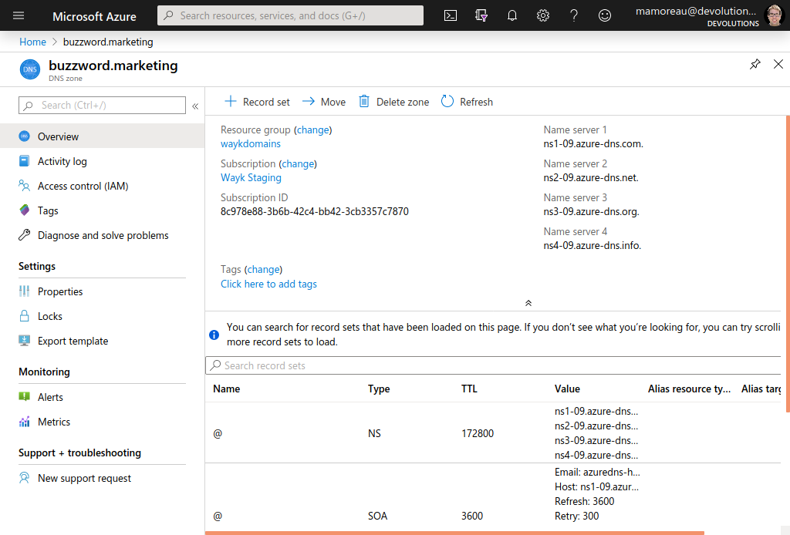

# Getting Started Guide (ACME/letsencrypt)

This getting started shows how to obtain free TLS certificates from [letsencrypt](https://letsencrypt.org/) using [Posh-ACME](https://github.com/rmbolger/Posh-ACME) and the [Azure DNS plugin](https://github.com/rmbolger/Posh-ACME/blob/master/Posh-ACME/DnsPlugins/Azure-Readme.md). Since letsencrypt certificates are valid only for 90 days, the process should be automated, but we will cover a simple manual procedure first. If you have never used letsencrypt before, it is a good way to get started.

## Prerequisites

For this getting started guide, we will be using:

-   A domain name (buzzword.marketing)
-   An Azure DNS zone for our domain
-   The Azure and Posh-ACME PowerShell modules

## Step 1: Obtain a domain

If you don’t have a domain available for testing, you can buy one from your favorite registrar. In our case, we have bought the "buzzword.marketing" domain from [namecheap](https://www.namecheap.com). Before going further, make sure you have access to the account used to configure DNS servers for the domain name you intend to use.

## Step 2: Create Azure DNS zone

Refer to the following Microsoft articles to create an Azure DNS zone:

-   [Quickstart: Create an Azure DNS zone and record using the Azure portal](https://docs.microsoft.com/en-us/azure/dns/dns-getstarted-portal)
-   [Tutorial: Host your domain in Azure DNS](https://docs.microsoft.com/en-us/azure/dns/dns-delegate-domain-azure-dns)

First, create an Azure DNS zone, and then obtain the list of the Microsoft name servers associated with it. These are the custom DNS servers that need to be configured with your domain registrar.

From the above screenshot, the custom name servers are:

-   ns1-09.azure-dns.com
-   ns2-09.azure-dns.net
-   ns3-09.azure-dns.org
-   ns4-09.azure-dns.info

These custom name servers need to be configured with your domain registrar in order to manage the domain from the Azure DNS zone. The procedure is different for each registrar, but here is procedure for [using custom DNS servers with namecheap](https://www.namecheap.com/support/knowledgebase/article.aspx/9837/46/how-to-connect-a-domain-to-a-server-or-hosting#hostingwtrd).

Once your domain is configured to be managed through the Azure DNS zone, you no longer need access to the registrar account aside from renewing your domain registration. All DNS records can be now be managed from Azure, which is perfect for performing the [ACME DNS challenge](https://letsencrypt.org/docs/challenge-types) required to prove ownership of a given domain with letsencrypt.

## Step 3: Request a certificate

This is where it can get tricky if you wish to automate things correctly, but there exists a rather a quick path to requesting certificates without too much trouble.

Open a PowerShell prompt, then install and import the [Az](https://www.powershellgallery.com/packages/Az) and [Posh-ACME](https://www.powershellgallery.com/packages/Posh-ACME) PowerShell modules:

    > Install-Module -Name Az
    > Install-Module -Name Posh-ACME
    > Import-Module Az
    > Import-Module Posh-ACME

*Az* is the [Azure PowerShell module](https://docs.microsoft.com/en-us/powershell/azure/install-az-ps), and [Posh-ACME](https://github.com/rmbolger/Posh-ACME) is a PowerShell module that supports the ACME protocol used by letsencrypt along with a rich set of plugins for integrating with DNS providers. In our case, we will be using the [Azure DNS plugin](https://github.com/rmbolger/Posh-ACME/blob/master/Posh-ACME/DnsPlugins/Azure-Readme.md) because our domain is managed with an Azure DNS zone.

Here is the plan: we will login to the Azure Portal using the Azure PowerShell module, grab the access token from the Az context and pass it to Posh-ACME such that it can proceed with the ACME DNS challenge. Since the access token expires every two minutes, you may have to login again if you get an expired token error. However, this procedure skips the trouble of configuring a separate account suitable for automation.

From the PowerShell prompt, call *Connect-AzAccount*. If you have more than one subscriptions, you should specify which one you wish to connect to, otherwise you will get the default subscription associated with your account:

    PS /home/mamoreau> Connect-AzAccount -Subscription 'wayk staging'

    Account                  SubscriptionName TenantId                             Environment
    -------                  ---------------- --------                             -----------
    mamoreau@devolutions.net Wayk Staging     cf76f217-2059-4091-bb00-878429f5cc64 AzureCloud

Follow the instructions given by the *Connect-AzAccount* command. 

You can now go back to your PowerShell prompt and do everything that can be done through the Azure Portal, but with PowerShell instead!

Copy and paste the following code snippet to grab the access token and prepare the parameters to be passed to the Azure DNS plugin:

    $az = Get-AzContext;

    $token = Get-AzAccessToken

    $AzParams = @{
            AZSubscriptionId=$az.Subscription.Id;
            AZAccessToken=$token.Token;
    }

Set the $CommonName variable to the domain for which you wish to request a certificate. In our code, we will be requesting a certificate for *test.buzzword.marketing*:

    $CommonName = "test.buzzword.marketing"

If this is the first time using letsencrypt, you will have to accept the terms of use. Run the following command once:

    New-PACertificate $CommonName -AcceptTOS -Contact admin@example.com

The contact email address is optional, and is used to receive expiration notifications. Proceed immediately to requesting your certificate:

    $Certificate = New-PACertificate $CommonName -DnsPlugin Azure -PluginArgs $AzParams
    $CertPath = Split-Path -Path $Certificate.PfxFile -Parent

If all went well, the New-PACertificate command should take about a minute to complete, with a "Waiting for DNS to propagate" message. If you get an error saying that the access token is expired, login again and run the token-grabbing code snippet again.

The $CertPath variable now point to the local directory where all the certificate files produced by Posh-ACME are stored. The default password (when none has been specified) is *poshacme*. The file of interest we will be using is *fullchain.pfx* because it contains both the full chain and the private key, but the certificate is also available in .pem and .key format.

That’s it, you now have a valid TLS certificate emitted by letsencrypt that you can use for testing! You can learn about more advanced options available from the [Posh-ACME tutorial](https://github.com/rmbolger/Posh-ACME/blob/master/Tutorial.md).
