# Getting Started Guide (Argo Tunnel)

This getting started guide provides instructions for setting up a one-time Wayk Bastion demo environment using a [free Cloudflare Argo tunnel](https://blog.cloudflare.com/a-free-argo-tunnel-for-your-next-project/) for external access.

## Step 1: Launch Wayk Bastion for localhost access only

Open a PowerShell terminal and load the `WaykDen` module. Create a new directory for your Wayk Bastion configuration files and move into it. Create a new configuration using your external URL and "windjammer.local" as the realm, then start Wayk Bastion:

    $ Import-Module WaykDen
    $ mkdir ~/den-test
    $ cd ~/den-test
    $ New-WaykDenConfig -Realm windjammer.local -ExternalUrl http://localhost:4000
    $ Start-WaykDen

The realm is a domain name for your Wayk Bastion, very similar to a Windows Active Directory domain name, but it does not need to be a valid DNS domain name. In this case, we use `windjammer.local` for a fictional company called "Windjammer".

Do not open <http://localhost:4000> in a browser yet. We will access it through the Argo tunnel instead. We just need Wayk Bastion to be running first for the Argo tunnel to be opened.

Leave this terminal open: we will come back to it later.

## Step 2: Create free Argo tunnel for external access

[Download](https://developers.cloudflare.com/argo-tunnel/downloads/) the `cloudflared` executable for your platform to a known path

Open a new terminal and move to the directory where the `cloudflared` executable is located. Then, confirm that the tool can be found at command-line:

    $ cloudflared --version
    cloudflared version 2019.12.0 (built 2019-12-19-2246 UTC)

Create a free Argo tunnel pointing to "http://localhost:4000" and wait for it to become ready:

    $ cloudflared tunnel --url http://localhost:4000

Search within the terminal output for your trycloudflare.com generated URL. It should look like this:

    INFO[0002] +--------------------------------------------------------+  connectionID=0
    INFO[0002] |  Your free tunnel has started! Visit it:               |  connectionID=0
    INFO[0002] |    https://wayk-den-demo-test.trycloudflare.com        |  connectionID=0
    INFO[0002] +--------------------------------------------------------+  connectionID=0

This terminal needs to remain open to keep the Argo tunnel active.

The free tunnel URL changes every time and is composed of 4 random words, but this is fine as we are using this for a one-time Wayk Bastion demo environment. You will get a different URL every time you create a free Argo tunnel, unless you register for the [paid service](https://developers.cloudflare.com/argo-tunnel/quickstart/).

For the purpose of this guide, the external URL is "https://wayk-den-demo-test.trycloudflare.com", but you will need to replace it with the one you obtained when following these instructions.

## Step 3: Launch Wayk Bastion using the Argo tunnel external URL

Now that we have launched the Argo tunnel, HTTP requests to "https://wayk-den-demo-test.trycloudflare.com" will be automatically redirected to "http://localhost:4000", with SSL/TLS certificates
automatically handled by Cloudflare.

Go back to the PowerShell terminal where Wayk Bastion was started. Stop Wayk Bastion, modify the external URL and start Wayk Bastion again.

    $ Stop-WaykDen
    $ Set-WaykDenConfig -ExternalUrl https://wayk-den-demo-test.trycloudflare.com
    $ Start-WaykDen

That’s it! You should now be able to open the external URL in a browser and see a login page.

## Step 4: Complete initial configuration from Wayk Bastion Web UI

Now that Wayk Bastion is running and available externally through an Argo tunnel, you can proceed to creating a first admin user.

Open your external URL ("https://wayk-den-demo-test.trycloudflare.com") in a browser. In a fresh installation, you can log in using the "wayk-admin" username and "wayk-admin" password, after which you will be asked to create your first admin user.

For the purpose of this guide, we will create the user "admin" with the password "admin123!". All passwords for test purposes will be the same as the username with "123!" appended to it.

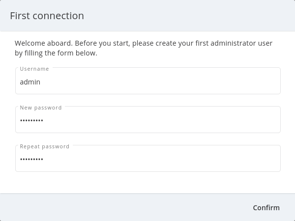

If you do not have a fresh database and wish to reset it, you can stop the Wayk Bastion, run "docker rm den-mongo" and "den volume rm den-mongodata" and start the Wayk Bastion.

Once logged in, click Users from the left navigation menu:

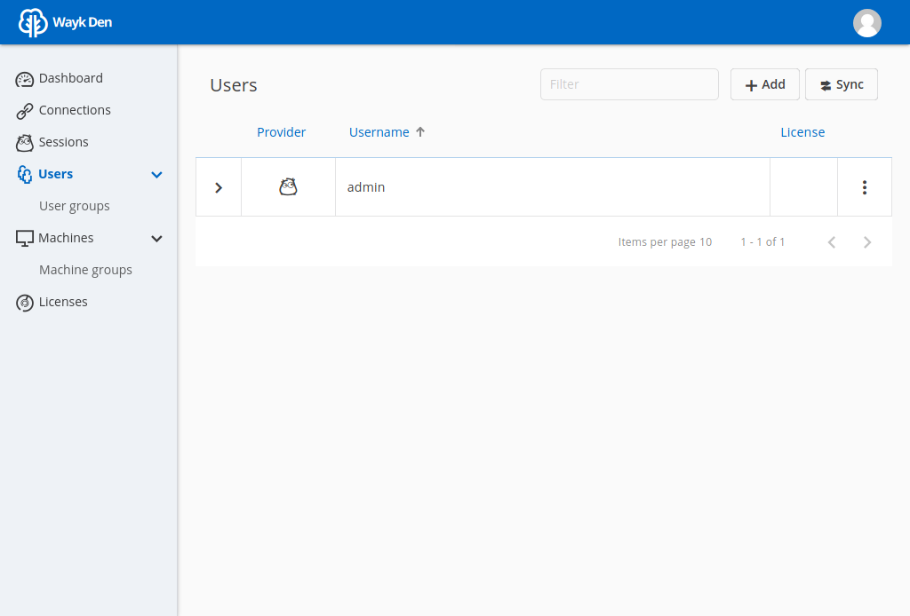

In the top right corner, click "Add" to create a user called "David Ford" with username "dford" and password "dford123!":

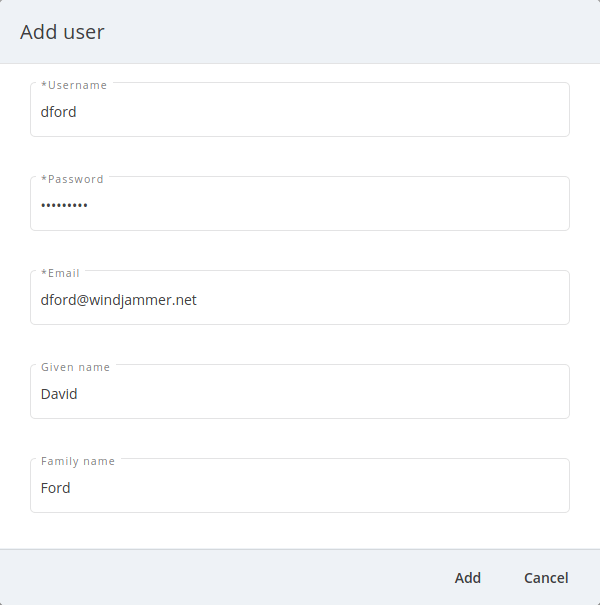

In the top right corner, click "Add" to create a user called "Robert Young" with username "ryoung" and password "ryoung123!":

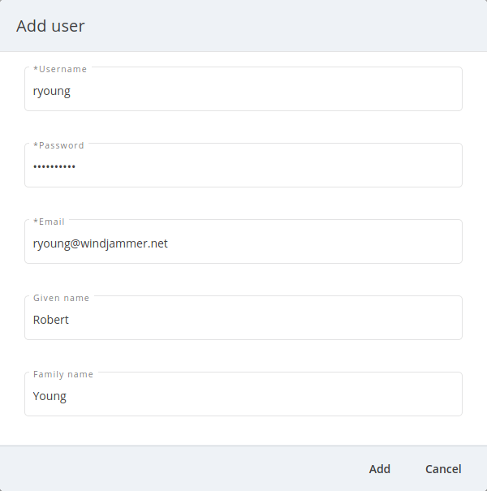

Your list of users should now look like this:

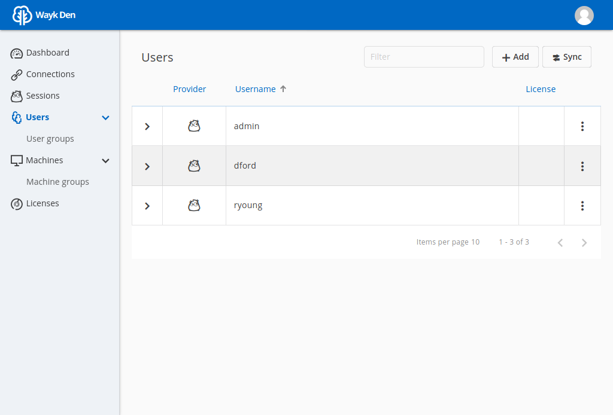

Click on the vertical ellipsis (⋮) button to the right of user "dford" to show a contextual action menu, then click "Manage role".

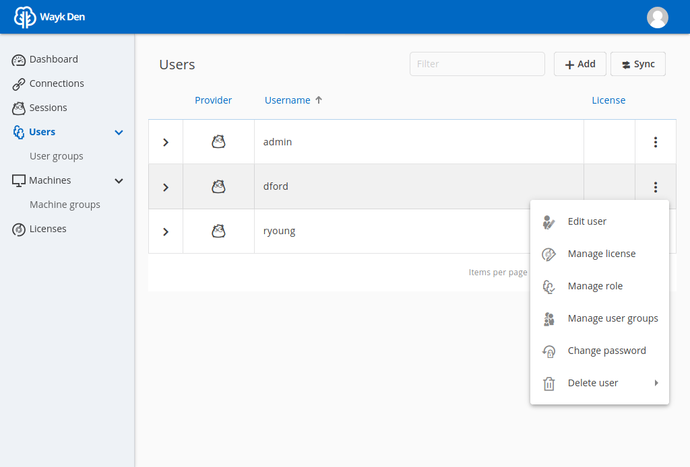

From the list of available roles, select "Machine contributor" then click the *+* sign to add the role to the current user.

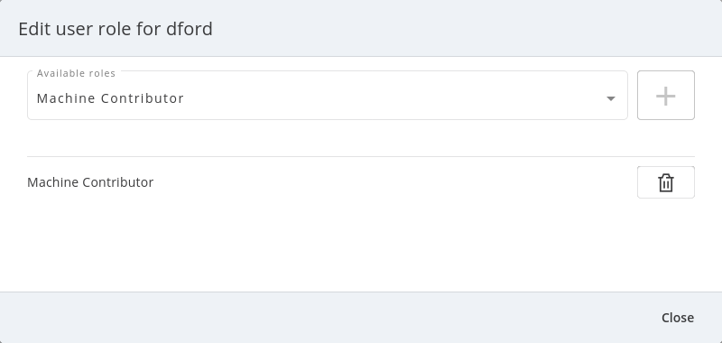

This role is required to register new unattended machines in Wayk Bastion, so you may want to perform the same operation for user "ryoung".

In a regular deployment, we would need to add a valid Wayk Now license in Wayk Bastion and assign it to users who want to make client connections. However, if you deploy Wayk Bastion using a [free cloudflare Argo tunnel](https://developers.cloudflare.com/argo-tunnel/trycloudflare/) (limited to \*.trycloudflare.com URLs), a special demo mode is activated where Wayk Bastion simulates having a site license configured. This means you can follow this guide without requesting a Wayk Now trial license.

You are now ready to try connecting Wayk Now to your Wayk Bastion with your test users.

## Step 5: Configure a Windows machine for unattended access

For the purpose of this guide, this machine will be called "DFORD-PC".

On a Windows machine, install [Wayk Now](https://wayk.devolutions.net/home/download) using the .msi installer. You can use the [Wayk Now online help](https://helpwayk.devolutions.net/) as reference.

Once installed, launch Wayk Now, then click File → Options from the menu of the main window.

Click "Unlock" at the bottom left of the Options window to elevate permissions and allow modifications to settings affecting the Wayk Now unattended service.

In the "Connectivity" section, change the "Wayk Bastion Server Url" value to your Wayk Bastion external URL (<https://wayk-den-demo-test.trycloudflare.com>) and click OK to apply the changes.

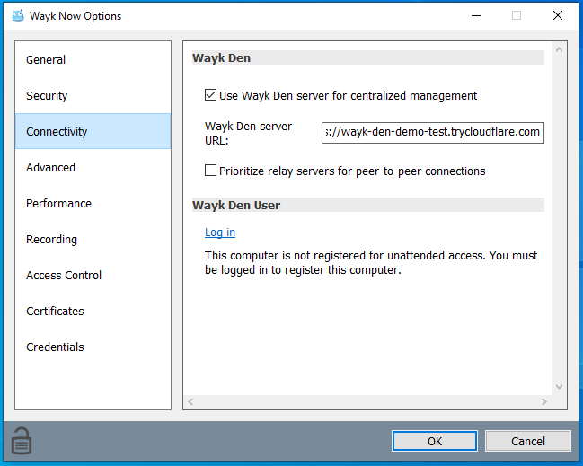

The Wayk Now main window status bar should show a red circle for a few seconds, then it should go back to green when it has connected to the new Wayk Bastion.

Go back to the "Connectivity" section of the Options window and unlock it again. Under "Wayk Now User", you should now see a "Log in" link.

Click "Log in" to open the Wayk Bastion login page with the default system browser. Enter "dford" as the username and "dford123!" as the password, then click Continue.

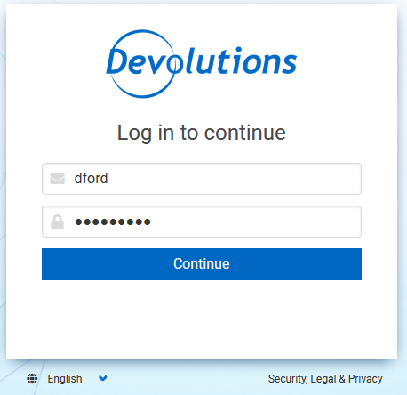

You should now see a login success page:

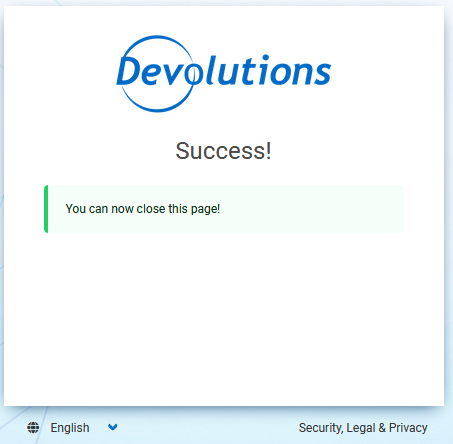

Close the browser and come back to the Wayk Now Options window. It should now show the user "dford" as logged in to Wayk Bastion:

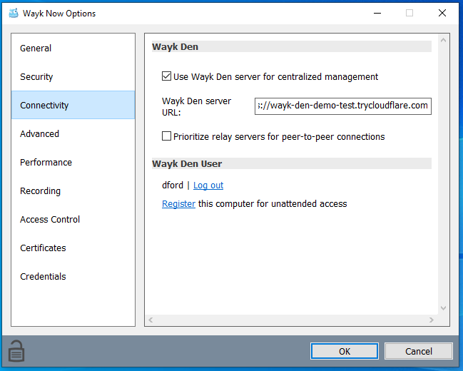

Last but not least, click "Register" to register the machine for unattended access.

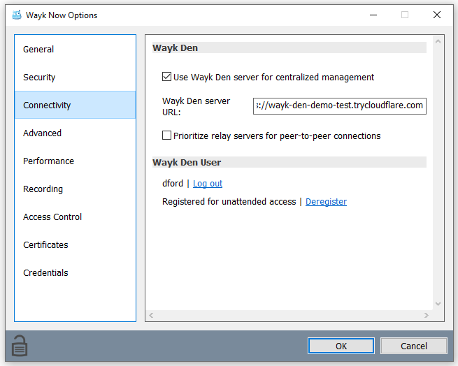

To verify that the machine was correctly registered, go back to the Wayk Bastion Web UI and go in the "Machines" section. Your machine should now be listed:

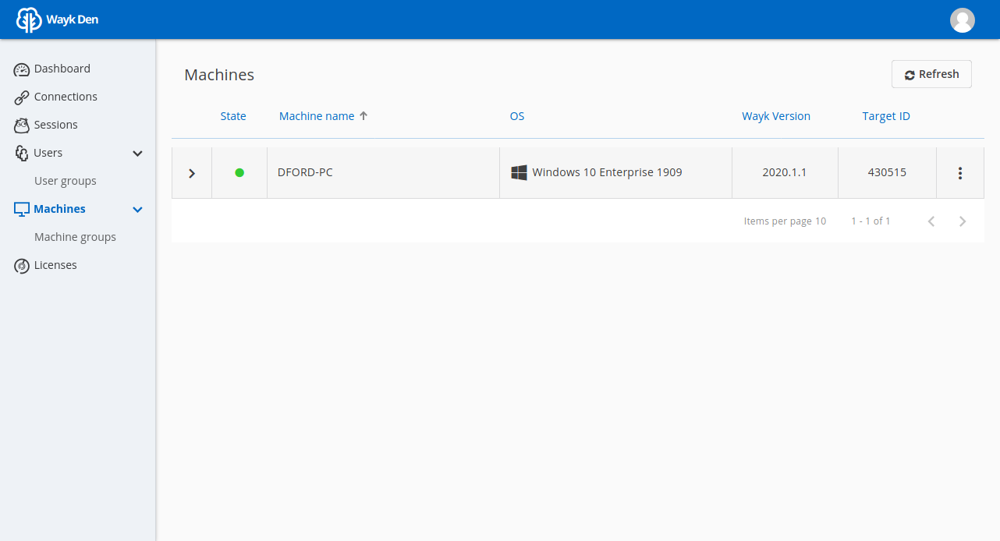

## Step 6: Connect to the Windows machine using a Wayk Now client

On another machine, install Wayk Now, and follow the instructions of the previous step for the Wayk Bastion configuration, with the exception of the unattended machine registration which is not required. When logging in, use "ryoung" as the username and "ryoung123!" as the password.

For the purpose of this guide, this machine will be called "RYOUNG-PC".

At this point, you should be able to see both machines connected to the Wayk Bastion in the "Connections" section:

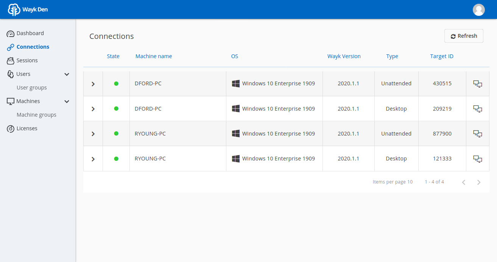

Each machine is shown as connected twice, because the unattended service and the Wayk Now client make separate connections to the Wayk Bastion.

From the connection list, we can see that the target ID of "DFORD-PC" is "430515". This target ID is also shown in the Wayk Now main window on DFORD-PC in the "Source ID" field.

On RYOUNG-PC, launch Wayk Now, type "430515" in the "Target ID" field and click "Connect":

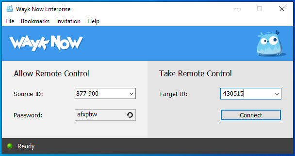

At the login prompt, select "Secure Remote Delegation (SRD)" and enter a valid system username + password for the target machine ("DFORD-PC").

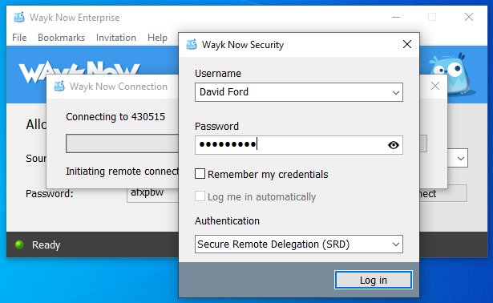

Once connected, you should now be able to see your active session in the "Sessions" section of the Wayk Bastion Web UI:

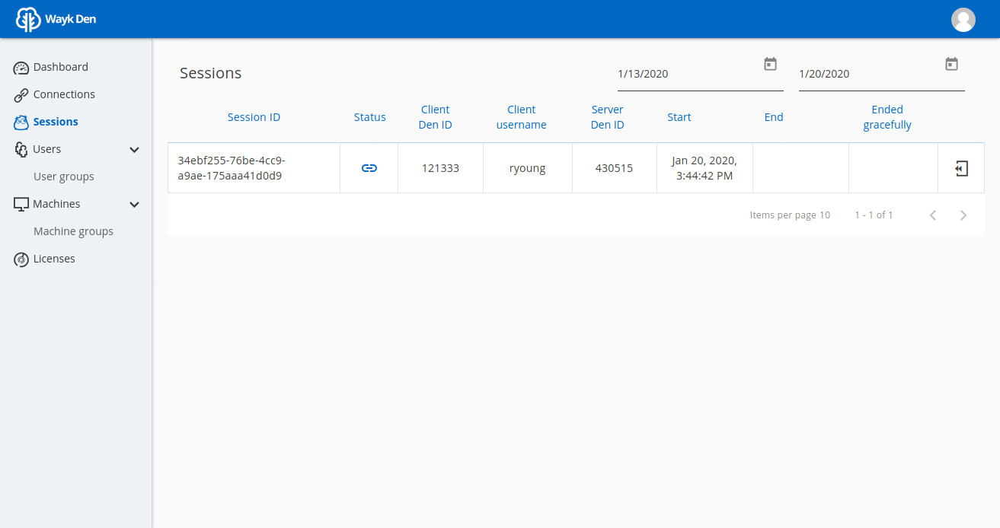

This list contains both current and past sessions for monitoring and auditing purposes.
