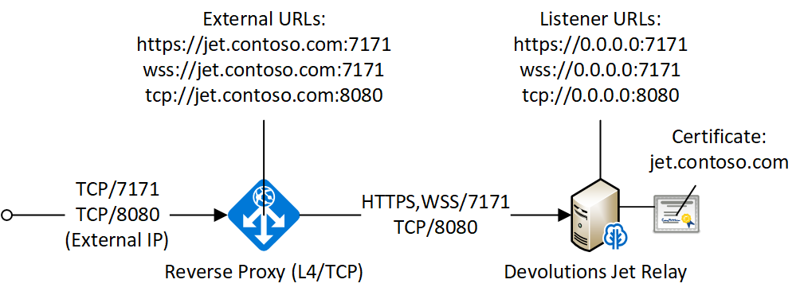
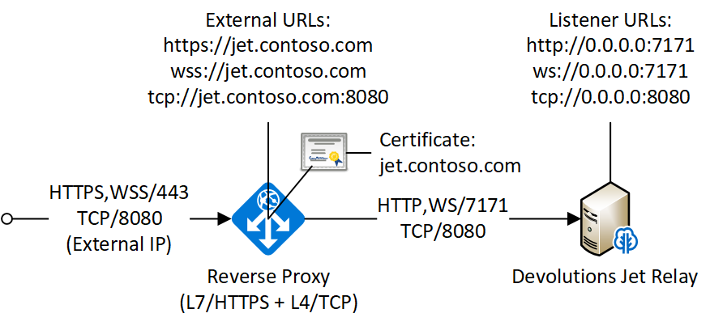
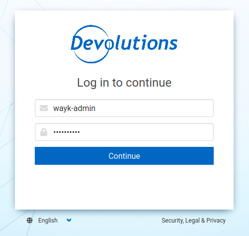

# Wayk Bastion Overview

>[!WARNING]
> We are in the process of rebranding Wayk Den to Wayk Bastion, so some of the documentation may be outdated. If you are upgrading from Wayk Den to Wayk Bastion, please follow the steps from the [migration guide](xref:wayk-migration-guide).

WaykBastion-ps is a PowerShell cmdlet for Wayk Bastion, the centralized server for [Devolutions Wayk Now](https://wayk.devolutions.net). For assistance or feature requests, please use the [Wayk forums](https://forum.devolutions.net/#WaykNow) or open a ticket on this github project.

Make sure you have all software prerequisites then read one of our getting started guides:

-   [getting started guide (Argo tunnel)](xref:getting-started-argo)
-   [getting started guide (Azure VM)](xref:getting-started-azure).
-   [getting started guide (ACME/letsencrypt)](xref:getting-started-acme).
-   [relay deployment guide](xref:gateway-deployment).
-   [IIS deployment guide](xref:iis-deployment).

Once you have been familiarized with Wayk Bastion, come back to this page for more details on specific aspects of the software.

## Installation

### PowerShell

On Windows, the regular PowerShell already installed can be used. On macOS and Linux, you will need [PowerShell 7](https://github.com/PowerShell/PowerShell#get-powershell). To launch a PowerShell 7 terminal, use the `pwsh` command.

#### PowerShell module

A powershell module is available to configure and manage the Wayk Bastion server. It is available on PSGallery or it could be built directly from [source code](https://github.com/Devolutions/WaykBastion-ps). We recommend to install the latest version available on PSGallery, but if needed, a section describe how to build it if you need it.

#### Installation from PSGallery

The Wayk Bastion PowerShell module is [available on PSGallery](https://www.powershellgallery.com/packages/WaykBastion).

    Install-Module -Name WaykBastion -AllowPrerelease
    Import-Module WaykBastion

If you encounter issues with the `Install-Module` command, you may have to [install or update PowerShellGet](https://docs.microsoft.com/en-us/powershell/scripting/gallery/installing-psget).

You can then list all commands exported from the `WaykBastion` module:

    Get-Command -Module WaykBastion

When a new version comes out, you can update the cmdlet and restart Wayk Bastion to upgrade. The updated cmdlet will point to newer versions of the docker containers used in Wayk Bastion, so upgrading is a simple matter of restarting Wayk Bastion:

    Update-Module -Name WaykBastion
    Import-Module WaykBastion
    Restart-WaykBastion

#### Installation from Source

If you have installed the module from PSGallery, this section is not useful for you. You can jump to the next section.

To build the cmdlet, you will need the [.NET SDK](https://dotnet.microsoft.com/download).

From PowerShell, run the build.ps1 script, and then load the resulting PowerShell module:

    .\build.ps1
    Import-Module "./WaykBastion" -Force

### Docker

[Docker Installation](xref:wayk-docker-installation)

## Deployment

Before jumping in to the configuration, let’s review the different deployment options.

Layer 4 deployment: Expose services externally through TCP (layer 4) and handle HTTPS inside Wayk Bastion.

Layer 7 deployment: Expose services externally through a layer 7 reverse proxy (HTTPS) that offloads TLS from Wayk Bastion.

### Wayk Bastion

### Jet Relay

## Configuration

All Wayk Bastion commands accept a -ConfigPath parameter to point to a directory where various configuration files are kept. If this parameter is not specified, the current working directory is used by default.

The first step is to create a Wayk Bastion configuration file with mandatory parameters using the `New-WaykBastionConfig` command.

You need to choose a realm for your Wayk Bastion, such as "contoso.net". This realm does not need to be a valid DNS domain name, but it will become your Wayk Bastion realm used in various places, including the peer-to-peer certificates generated by the Wayk Bastion built-in certificate authority.

The second mandatory parameter is the external URL at which the Wayk Bastion will be exposed. We recommend using the "den" subdomain under the domain of your choice, such as "den.contoso.net". The protocol prefix (`http://` or `https://`) also needs to be included.

Create a new Wayk Bastion configuration file, using "contoso.net" as realm and "https://den.contoso.net" as the external url:

    PS > New-WaykBastionConfig -Realm contoso.net -ExternalUrl https://den.contoso.net -ListenerUrl http://localhost:4000

The listener url is used to specify the listening protocol and port on the machine where Wayk Bastion is running. To listen in https, a certificate needs to be imported before changing the listener URL protocol.

### Initial Setup

When accessing the Web UI for the first time, login using the default username ("wayk-admin") and password ("wayk-admin"):

You will then be asked to create your first admin account to replace the default one:

It should also be noted that you can access the Wayk Bastion Web UI locally through the configured listener URL (<http://localhost:4000> by default) for convenience, as an intermediate step before configuring the external URL.

### Certificate configuration

To expose Wayk Bastion to the external world, you will need a TLS certificate from a trusted certificate authority such as [Let's Encrypt](https://letsencrypt.org/). Wayk Now will validate certificates in the same way as a browser does for a website.

If you wish to make your own certificate authority, the Root CA certificate will need to be installed in each machine’s certificate trust store. If the system browser can validate it, Wayk Now should be able to validate it as well, it’s just a lot more work.

Before going any further, check the following points:

1.  The certificate name matches your configured external URL. This
    means that if your external URL is "https://den.contoso.com" then
    your certificate name should be "den.contoso.com" or
    "\*.contoso.com" if you have a wildcard certificate.
2.  The certificate is either in pem + key or pfx (PKCS\#12) format. The
    private key password is only supported for the pfx format.
3.  The certificate file contains the certificate **chain** excluding
    the Root CA. This means that in most cases, you should have a leaf
    certificate, followed by one or more intermediate certificates. If
    validation works in a browser but not in Wayk Now, the intermediate
    certificate is likely missing.

The PEM format is the simplest to work with, since it is the Base64 representation of the DER-encoded certificate in between "-----BEGIN CERTIFICATE-----" and "-----END CERTIFICATE-----" tags. To add the intermediate certificate to the certificate file, just append it after your leaf certificate in a text editor.

    PS > Import-WaykBastionCertificate -CertificateFile /path/to/certificate.pem -PrivateKeyFile /path/to/private_key.key

    PS > Import-WaykBastionCertificate -CertificateFile /path/to/certificate.pfx -Password <password>

## Running

Start Wayk Bastion, and wait for all containers to start:

    PS > Start-WaykBastion

Once started, Wayk Bastion listens on <http://localhost:4000> by default.

Alternatively, if you want to see the complete docker commands executed by the "Start-WaykBastion" command, you can use the *-Verbose* parameter:

    PS > Start-WaykBastion -Verbose

You can check that all containers are up and running with the `docker ps -f network=den-network` command.

To confirm everything is correctly configured, you should be able to get a response from the Wayk Bastion well known configuration endpoint:

    curl http://localhost:4000/.well-known/configuration
    {"den_router_uri":"https://den.contoso.net/cow","lucid_uri":"https://den.contoso.net/lucid","realm":"contoso.net","wayk_client_id":"zqdvSbCRWdDrj1fQXwzPQbCg"}

If you have correctly configured external access, you should be able to get the same response using the external configuration URL (<https://den.contoso.net/.well-known/configuration>).

Stop Wayk Bastion, and wait for all containers to stop:

    PS > Stop-WaykBastion

### System Service

It is possible to register a system service on Windows to automatically call Start-WaykBastion / Stop-WaykBastion in a given config directory.

Instead of using a local user directory for the configuration files, the service should be installed in a global directory with restricted permissions like this:

    PS > $ConfigPath = Get-WaykBastionPath ConfigPath
    PS > $ConfigPath
    C:\ProgramData\Devolutions\Wayk Den
    PS > New-Item -Path $ConfigPath -Type Directory -Force

The "Get-WaykBastionPath ConfigPath" command returns the recommended directory for the current platform where files should be stored.

If you already have a directory with your Wayk Bastion configuration files, you should move them to the new location. You can then proceed with the service registration:

    PS > Set-Location $ConfigPath
    PS > Register-WaykBastionService -ServicePath $ConfigPath
    "WaykBastion" service has been installed to "C:\ProgramData\Devolutions\Wayk Den"
    PS > Get-Service WaykBastion

    Status   Name               DisplayName
    ------   ----               -----------
    Stopped  WaykBastion            Wayk Den
    PS > Start-Service WaykBastion

Wait for the service to start, this can take some time. If you look at the files in the directory, you should see "WaykBastion.exe", which is the service executable, and "WaykBastion.log", the service log file:

    PS > Get-ChildItem

        Directory: C:\ProgramData\Devolutions\Wayk Bastion

    Mode                LastWriteTime         Length Name
    ----                -------------         ------ ----
    d-----         4/2/2020   5:21 PM                den-server
    d-----         4/2/2020   5:06 PM                traefik
    -a----         4/7/2020   4:34 PM            314 service.json
    -a----         4/2/2020   5:06 PM            909 wayk-den.yml
    -a----         4/2/2020   5:33 PM         770048 WaykBastion.exe
    -a----         4/7/2020   4:07 PM           2753 WaykBastion.log

If you encounter issues with Wayk Bastion not working as expected when launched through the system service, the best way to debug the issue is to go in the same directory as the service and run the "Start-WaykBastion" command manually to see what happens.

The system service is a wrapper over the cmdlet. If you need to remove it, you can call the *Unregister-WaykBastionService* function:

    PS > Unregister-WaykBastionService -ServicePath $ConfigPath

You can also update the service wrapper executable when never versions of the cmdlet are published by calling Register-WaykBastionService again.
