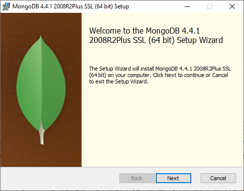
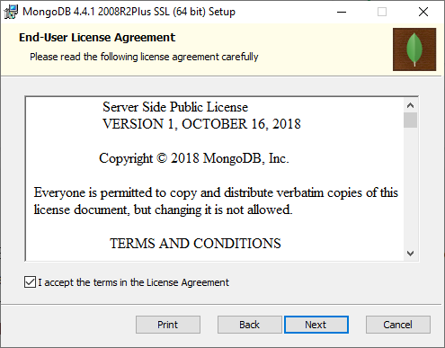
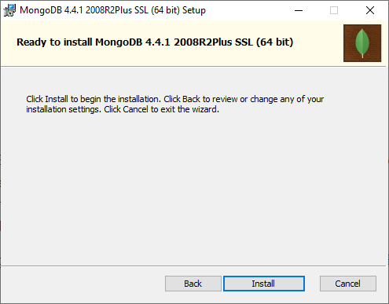
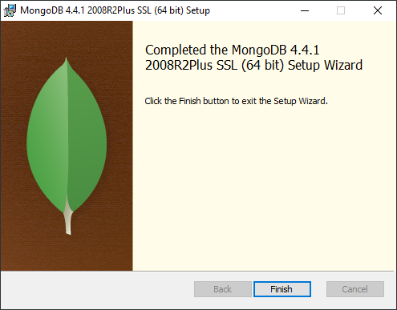

# MongoDB Installation

By default, the Wayk Bastion PowerShell module creates MongoDB container and a Docker volume to store its data. While this may be good enough for most, a regular MongoDB installation is preferable, especially if high availability is required.

## Windows

Download the [MongoDB .msi installer for Windows](https://www.mongodb.com/try/download/community).


Launch the .msi installer, then click Next.



Accept the license agreement, then click Next.



Leave the default options, then click Next.


If you wish to install MongoDB Compass, check "Install MongoDB Compass", then click Next. While it is a very convenient MongoDB GUI, it can take several minutes to install.


Click Install to begin the installation.



Wait for the installation to complete. If you selected MongoDB Compass, it will take a few minutes, so be patient.


Click Finish to complete the installation.



That's it, you should now have a "MongoDB" system service started automatically, with files stored under "C:\Program Files\MongoDB\Server".

## Migrating to an external database

If you have been using the internal database automatically created as a Windows container, follow these steps to migrate your data and switch to the new MongoDB database server.

```powershell
Enter-WaykBastion -ChangeDirectory
Stop-WaykBastion
$BackupFile = $(Get-Date -Format FileDataUniversal)
Backup-WaykBastionData -BackupPath ".\${BackupFile}"
```

In order to perform MongoDB management on the host, you will need to install the [MongoDB management tools](https://docs.mongodb.com/database-tools/installation/).

Download the [.msi installer](https://www.mongodb.com/try/download/database-tools) or equivalent package for your platform:


Once installed, the tools should be located in directory that looks like "C:\Program Files\MongoDB\Tools\100\bin".
