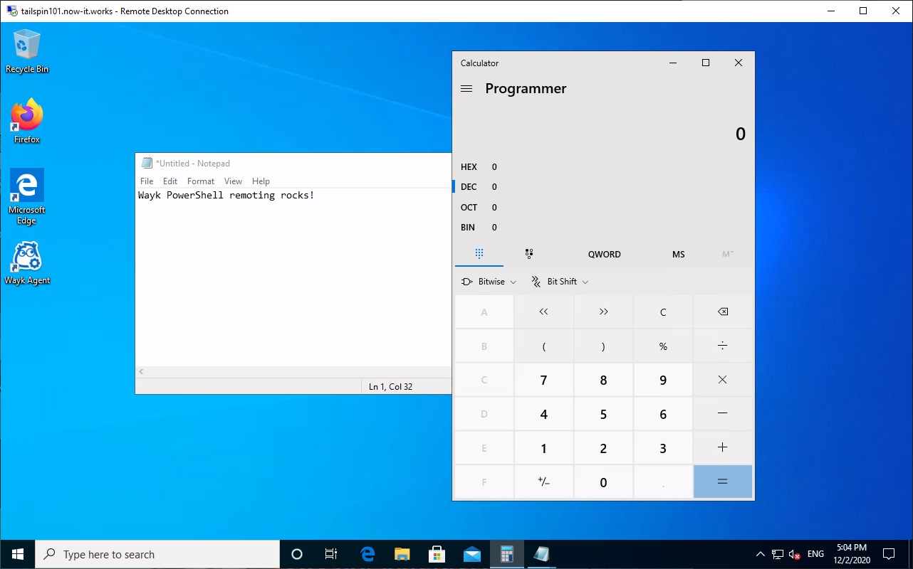

# Wayk PowerShell Remoting

## Requirements

### PowerShell 7

Wayk PowerShell remoting *requires* PowerShell 7 on both sides:
 * The local machine running Wayk Client
 * The target machine running Wayk Agent

Windows PowerShell 5.1 *cannot* be used for Wayk PowerShell remoting. [Install PowerShell 7](https://github.com/PowerShell/PowerShell#get-powershell) and then make sure that "pwsh" is available in your PATH as opposed to "powershell".

### PowerShell Module

The [WaykClient PowerShell module](https://www.powershellgallery.com/packages/WaykClient) is needed to launch a Wayk PowerShell session from PowerShell:

```powershell
Install-Module WaykClient
```

Once the `WaykClient` PowerShell module is installed, you can import it, and list the commands it contains to get started:

```powershell
Import-Module WaykClient
Get-Command -Module WaykClient
```

### Wayk Client

This may look obvious, but it is important to know that the regular Wayk Client application needs to be installed, configured and logged in to Wayk Bastion before using Wayk PowerShell remoting.

The `WaykClient` PowerShell module does not make its own separate connection to Wayk Bastion, it simply calls the existing Wayk Client program to initiate the connection to the target machine.

Wayk PowerShell remoting in the Wayk Client is supported on Windows, macOS and Linux, as long as PowerShell 7 is installed.

### Wayk Agent

Wayk PowerShell remoting in the Wayk Agent is currently only supported on Windows, but macOS and Linux support is coming. Again, [PowerShell 7 must be installed on the target machine](https://github.com/PowerShell/PowerShell#get-powershell), as the built-in Windows PowerShell 5.1 cannot be used.

## Launching Connection

Start by reviewing the following points:
1. The Wayk Client application is running and logged in Wayk Bastion, as if ready to launch a Wayk remote desktop connection.
1. PowerShell 7 is installed on both sides: Wayk Client (local machine) and Wayk Agent (target machine).

Open a PowerShell terminal, make sure that it is running PowerShell 7 or later, then import the `WaykClient` PowerShell module:

```powershell
PS > $PSVersionTable.PSVersion.ToString()
7.1.0
PS > Import-Module WaykClient
```

Create a new `PSCredential` object using the `Get-Credential` command with valid credentials for the target machine:

```powershell
PS > $Credential = Get-Credential

PowerShell credential request
Enter your credentials.
User: wayk-admin
Password for user wayk-admin: ********
```

You can now use the `Enter-WaykPSSession` command to launch a remote session:

```powershell
PS > $HostName = 'tailspin101'
PS > Enter-WaykPSSession -HostName $HostName -Credential $Credential
[tailspin101]: PS > [Environment]::MachineName
TAILSPIN101
```

An alternative way to connect is using the `New-WaykPSSession` command to obtain the `PSSession` object without necessarily entering the session interactively:

```powershell
PS > $HostName = 'tailspin101'
PS > $Session = New-WaykPSSession -HostName $HostName -Credential $Credential
PS > Invoke-Command -Session $Session { [Environment]::MachineName }
TAILSPIN101
PS > Enter-WaykPSSession -Session $Session
[tailspin101]: PS >
```

## PowerShell Remoting Internals

If you want to learn more about how it works under the hood, you can do the steps manually using `Connect-WaykPSSession`, which modifies the current environment prior to calling the regular `Enter-PSSession` or `New-PSSession` commands:

```powershell
PS > $UserName = 'wayk-admin'
PS > $Password = ConvertTo-SecureString -String "wayk123!" -AsPlainText -Force
PS > $Credential = [PSCredential]::New($UserName, $Password)
PS > $HostName = 'tailspin101'
PS > Connect-WaykPSSession -HostName $HostName -Credential $Credential
PS > Enter-PSSession -HostName $HostName -UserName $UserName
[tailspin101]: PS >
```

After a successful `Connect-WaykPSSession` call, the current `PATH` environment variable has modified modified to point to a special SSH replacement executable meant to connect to an ephemeral WebSocket URL. Wayk PowerShell remoting uses the SSH transport without SSH, so you don't even need to have real OpenSSH client or server installed. In fact, here's proof:

```powershell
[tailspin101]: PS > Get-WindowsCapability -Online | ? Name -Like 'OpenSSH.Server*'

Name  : OpenSSH.Server~~~~0.0.1.0
State : NotPresent

[tailspin101]: PS > Get-Service sshd
Get-Service: Cannot find any service with service name 'sshd'.
```

For a detailed explanation of how this is possible, read the [PowerShell Remoting Over SSH, Without SSH!](https://blog.devolutions.net/2020/07/powershell-remoting-over-ssh-without-ssh) blog post.

## Interacting with GUI Applications

Regular PowerShell remoting does not allow interaction with GUI applications, but Wayk PowerShell remoting is perfectly capable of it. 

To try it out, open a remote desktop session to target using Wayk or RDP, and then connect to the same target machine with the same user using Wayk PowerShell remoting.

You can then use `Start-Process` to launch GUI applications in the same user session from the Wayk PowerShell remoting session:

```powershell
[tailspin101]: PS > Start-Process 'notepad'
[tailspin101]: PS > Start-Process 'calc'
```

You should normally see those programs appear in the remote desktop session, which is not something that can be done with regular PowerShell remoting:



If interacting with GUI applications over Wayk PowerShell remoting is a feature of interest to you, please let us know by [commenting on our forums](https://forum.devolutions.net/product/wayk-bastion).
